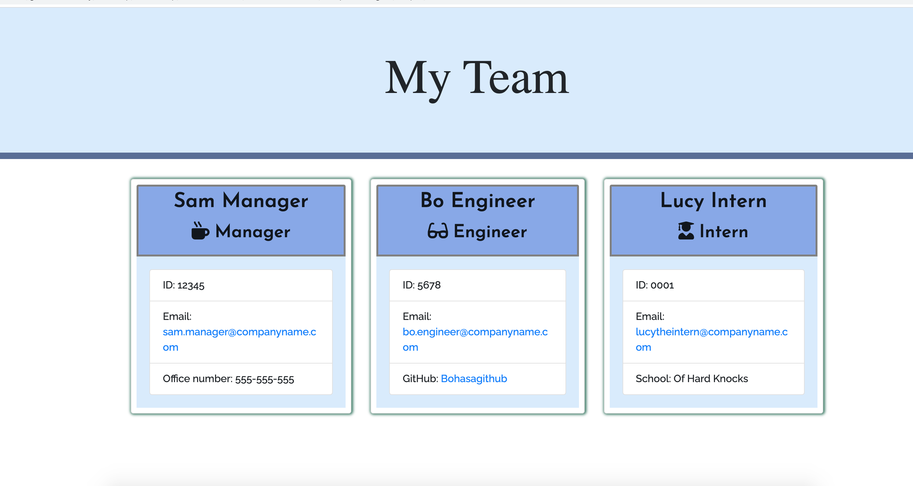

  

  # Team Member Card Generator

  ## Description
 This is a CLI based application. This can be used as the Manager or a team of Engineers and Interns to create a visual display of team Members. Each card contains the team member's name, email, github (if applicable), school (if applicable), and office number (if applicable). 

  

  ## Table of Contents
  * [Description](#Description)
  * [Installation](#Installation)
  * [Usage](#Usage)
  * [Contributing](#Contributing)
  * [Tests](#Tests)
  * [Questions](#Questions)
  * [Author](#Author)
  * [License](#License)

  ## Installation
  This application is intalled via node.js with an npm dependency.

  ## Usage
  Once you've forked the repository and cloned into your personal directory, you'll intall the necessary dependencies and run with node.js This application will then prompt you through a series of questions from the Manager's perspective to complete a "Team.html" page.

  ## Contributing
  If you'd like to expand upon this application, please fork the repository and code away. You may also reach out to me directly if you wish to collaborate.

  ## Tests
  To test the code, you can run via VScode or any other coding platform, then display in any browser.

  ## Questions
  Please send any questions or comments to the author listed below.

  ## Author:
  Gabrielle Maxey

  Email: gmaxeyg@gmail.com

  Github: <https://github.com/GabrielleM45>

  ## License
  *This application is Licensed under the following license:*\
  **[mit](https://choosealicense.com/licenses/mit/)**

